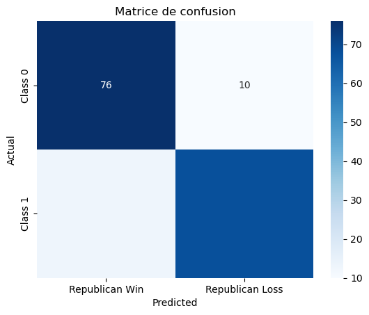

# Est-ce que les informations de recensement permettent de prédire le vote des Américains ?

Ce notebook a pour objectif d'évaluer si les données de recensements par contés effectués durants les années des élections présidentielles aux États-Unis permettent de prédire pour qui ils vont voter majoritairement voter.

Le Dataset utilisé est **US Census and Election Results (2000-2020)** et provient du site [kaggle](https://www.kaggle.com/datasets/minhbtnguyen/us-census-for-election-predictions-20002020).

Le jeu de donné utilise contient des informations sur : 
- l'âge moyen
- le revenu moyen (personnel et familial)
- la situation familiale (marié, séparé, célibataire)
- l'ethnie
- la citoyenneté
- la langue parlée dans le foyer
- le niveau d'étude
- le taux d'emploi

Plusieurs bilbiothèques sont utilisées dans le notebook et voici leurs utilités : 
- NumPy : Pour effectuer des calculs numériques rapides et manipuler des tableaux multidimensionnels.
- Pandas : Pour la manipulation et l'analyse de données tabulaires via les DataFrames.
- Scikit-learn : Pour le machine learning en Python, notamment pour diviser les données (train_test_split), rechercher les meilleurs hyperparamètres (GridSearchCV), et utiliser des modèles comme SVM (SVC).
- Preprocessing : Pour normaliser et standardiser les données avant l'entraînement des modèles.
- Metrics : Pour évaluer les performances des modèles de classification avec des métriques comme classification_report et confusion_matrix.
- Seaborn : Pour créer des visualisations statistiques attrayantes et informatives.
- Matplotlib : Pour créer divers types de graphiques et visualisations de données.


```python
import numpy as np
import pandas as pd
from sklearn.model_selection import train_test_split, GridSearchCV
from sklearn.preprocessing import StandardScaler, scale
from sklearn.svm import SVC
from sklearn.metrics import classification_report, confusion_matrix
import seaborn as sns
import matplotlib.pyplot as plt
```

### Étape 1 : Import des données
Dans on premier temps on importe le fichier téléchargé sur Kaggle et on affiche son contenu résumé.


```python
data = pd.read_csv('county_census_and_election_result.csv')
data.head()
```


<div>
<style scoped>
    .dataframe tbody tr th:only-of-type {
        vertical-align: middle;
    }

    .dataframe tbody tr th {
        vertical-align: top;
    }

    .dataframe thead th {
        text-align: right;
    }
</style>
<table border="1" class="dataframe">
  <thead>
    <tr style="text-align: right;">
      <th></th>
      <th>year</th>
      <th>county_fips</th>
      <th>inctot</th>
      <th>mortamt1</th>
      <th>avrg_age</th>
      <th>ftotinc</th>
      <th>foodstmp_1_freq</th>
      <th>foodstmp_2_freq</th>
      <th>sex_2_freq</th>
      <th>sex_1_freq</th>
      <th>...</th>
      <th>empstat_3.0_freq</th>
      <th>empstat_2.0_freq</th>
      <th>state_po</th>
      <th>county_name</th>
      <th>democrat</th>
      <th>green</th>
      <th>liberitarian</th>
      <th>other</th>
      <th>republican</th>
      <th>winner</th>
    </tr>
  </thead>
  <tbody>
    <tr>
      <th>0</th>
      <td>2000</td>
      <td>1</td>
      <td>24566.4</td>
      <td>634.6</td>
      <td>46.0</td>
      <td>46912.7</td>
      <td>93.6</td>
      <td>6.4</td>
      <td>54.0</td>
      <td>46.0</td>
      <td>...</td>
      <td>38.4</td>
      <td>3.2</td>
      <td>NaN</td>
      <td>NaN</td>
      <td>NaN</td>
      <td>NaN</td>
      <td>NaN</td>
      <td>NaN</td>
      <td>NaN</td>
      <td>NaN</td>
    </tr>
    <tr>
      <th>1</th>
      <td>2000</td>
      <td>2</td>
      <td>33842.9</td>
      <td>1080.1</td>
      <td>42.4</td>
      <td>65021.9</td>
      <td>95.3</td>
      <td>4.7</td>
      <td>50.3</td>
      <td>49.7</td>
      <td>...</td>
      <td>25.2</td>
      <td>4.8</td>
      <td>NaN</td>
      <td>NaN</td>
      <td>NaN</td>
      <td>NaN</td>
      <td>NaN</td>
      <td>NaN</td>
      <td>NaN</td>
      <td>NaN</td>
    </tr>
    <tr>
      <th>2</th>
      <td>2000</td>
      <td>4</td>
      <td>28331.7</td>
      <td>814.7</td>
      <td>45.3</td>
      <td>52826.7</td>
      <td>95.8</td>
      <td>4.2</td>
      <td>52.1</td>
      <td>47.9</td>
      <td>...</td>
      <td>38.3</td>
      <td>3.2</td>
      <td>NaN</td>
      <td>NaN</td>
      <td>NaN</td>
      <td>NaN</td>
      <td>NaN</td>
      <td>NaN</td>
      <td>NaN</td>
      <td>NaN</td>
    </tr>
    <tr>
      <th>3</th>
      <td>2000</td>
      <td>5</td>
      <td>22782.6</td>
      <td>557.5</td>
      <td>46.2</td>
      <td>43941.3</td>
      <td>92.5</td>
      <td>7.5</td>
      <td>53.0</td>
      <td>47.0</td>
      <td>...</td>
      <td>37.8</td>
      <td>3.2</td>
      <td>NaN</td>
      <td>NaN</td>
      <td>NaN</td>
      <td>NaN</td>
      <td>NaN</td>
      <td>NaN</td>
      <td>NaN</td>
      <td>NaN</td>
    </tr>
    <tr>
      <th>4</th>
      <td>2000</td>
      <td>6</td>
      <td>32245.0</td>
      <td>1216.3</td>
      <td>43.8</td>
      <td>61455.3</td>
      <td>95.7</td>
      <td>4.3</td>
      <td>52.0</td>
      <td>48.0</td>
      <td>...</td>
      <td>35.1</td>
      <td>3.6</td>
      <td>NaN</td>
      <td>NaN</td>
      <td>NaN</td>
      <td>NaN</td>
      <td>NaN</td>
      <td>NaN</td>
      <td>NaN</td>
      <td>NaN</td>
    </tr>
  </tbody>
</table>
<p>5 rows × 45 columns</p>
</div>


### Étape 2 : Suppression des données manquantes
Les élections américaines n'ont lieu que tous les 4 ans, il n'y a donc pas de données de vote à corréler avec des données de recensement dans pour 3 années sur 4. Cela ne pose pas de soucis car SVM fonctionne avec des jeux de données de taille modérée.


```python
data_cleaned = data.dropna(subset=['winner'])
data_cleaned = data_cleaned.drop(labels=['democrat', 'green', 'liberitarian', 'other', 'republican'], axis=1)
data_cleaned.head()
```


<div>
<style scoped>
    .dataframe tbody tr th:only-of-type {
        vertical-align: middle;
    }

    .dataframe tbody tr th {
        vertical-align: top;
    }

    .dataframe thead th {
        text-align: right;
    }
</style>
<table border="1" class="dataframe">
  <thead>
    <tr style="text-align: right;">
      <th></th>
      <th>year</th>
      <th>county_fips</th>
      <th>inctot</th>
      <th>mortamt1</th>
      <th>avrg_age</th>
      <th>ftotinc</th>
      <th>foodstmp_1_freq</th>
      <th>foodstmp_2_freq</th>
      <th>sex_2_freq</th>
      <th>sex_1_freq</th>
      <th>...</th>
      <th>educ_attain_2.0_freq</th>
      <th>educ_attain_1.0_freq</th>
      <th>educ_attain_3.0_freq</th>
      <th>educ_attain_4.0_freq</th>
      <th>empstat_1.0_freq</th>
      <th>empstat_3.0_freq</th>
      <th>empstat_2.0_freq</th>
      <th>state_po</th>
      <th>county_name</th>
      <th>winner</th>
    </tr>
  </thead>
  <tbody>
    <tr>
      <th>1529</th>
      <td>2008</td>
      <td>1003</td>
      <td>27222.4</td>
      <td>902.2</td>
      <td>48.6</td>
      <td>53308.6</td>
      <td>94.2</td>
      <td>5.8</td>
      <td>52.5</td>
      <td>47.5</td>
      <td>...</td>
      <td>51.8</td>
      <td>39.3</td>
      <td>8.4</td>
      <td>0.5</td>
      <td>54.1</td>
      <td>43.5</td>
      <td>2.4</td>
      <td>AL</td>
      <td>BALDWIN</td>
      <td>1.0</td>
    </tr>
    <tr>
      <th>1530</th>
      <td>2008</td>
      <td>1015</td>
      <td>20951.6</td>
      <td>551.7</td>
      <td>47.1</td>
      <td>39712.5</td>
      <td>89.1</td>
      <td>10.9</td>
      <td>54.8</td>
      <td>45.2</td>
      <td>...</td>
      <td>41.1</td>
      <td>52.6</td>
      <td>5.0</td>
      <td>1.2</td>
      <td>54.3</td>
      <td>41.1</td>
      <td>4.5</td>
      <td>AL</td>
      <td>CALHOUN</td>
      <td>1.0</td>
    </tr>
    <tr>
      <th>1531</th>
      <td>2008</td>
      <td>1055</td>
      <td>24017.6</td>
      <td>658.6</td>
      <td>48.2</td>
      <td>47650.0</td>
      <td>94.2</td>
      <td>5.8</td>
      <td>54.6</td>
      <td>45.4</td>
      <td>...</td>
      <td>45.3</td>
      <td>46.6</td>
      <td>7.9</td>
      <td>0.2</td>
      <td>50.3</td>
      <td>46.8</td>
      <td>2.9</td>
      <td>AL</td>
      <td>ETOWAH</td>
      <td>1.0</td>
    </tr>
    <tr>
      <th>1532</th>
      <td>2008</td>
      <td>1073</td>
      <td>28109.5</td>
      <td>812.4</td>
      <td>47.2</td>
      <td>54993.2</td>
      <td>93.5</td>
      <td>6.5</td>
      <td>55.0</td>
      <td>45.0</td>
      <td>...</td>
      <td>47.8</td>
      <td>42.0</td>
      <td>9.3</td>
      <td>0.9</td>
      <td>58.5</td>
      <td>38.1</td>
      <td>3.4</td>
      <td>AL</td>
      <td>JEFFERSON</td>
      <td>0.0</td>
    </tr>
    <tr>
      <th>1533</th>
      <td>2008</td>
      <td>1081</td>
      <td>24870.4</td>
      <td>725.1</td>
      <td>40.6</td>
      <td>45575.0</td>
      <td>92.4</td>
      <td>7.6</td>
      <td>52.1</td>
      <td>47.9</td>
      <td>...</td>
      <td>53.3</td>
      <td>32.2</td>
      <td>10.8</td>
      <td>3.7</td>
      <td>59.8</td>
      <td>36.3</td>
      <td>3.8</td>
      <td>AL</td>
      <td>LEE</td>
      <td>1.0</td>
    </tr>
  </tbody>
</table>
<p>5 rows × 40 columns</p>
</div>


### Étape 3 : Vérification des données possibles
Ici, on va s'assurer que le résultat est booléen. Soit le conté a voté en majorité pour le candidate Républicain (valeur de 1), soit non (valeur de 0 pour les Démocrates). On s'assure aussi qu


```python
data_cleaned['winner'].unique()
```


    array([1., 0.])


### Étape 4 : Nettoyage des données inutiles
Dans notre cas, le données fournies contiennent des informations sur le conté comme son numéro, son nom, l'état dans lequel il se situe. Ces données ne sont pas nécessaire pour répondre à notre problématique. On peut donc utiliser une variable pour conserver uniquement les colonnes que l'on souhaite.


```python
columns_to_keep =[
    "inctot",
    "mortamt1",
    "avrg_age",
    "ftotinc",
    "foodstmp_1_freq",
    "foodstmp_2_freq",
    "sex_2_freq",
    "sex_1_freq",
    "marst_5_freq",
    "marst_6_freq",
    "marst_1_freq",
    "marst_4_freq",
    "marst_3_freq",
    "marst_2_freq",
    "race_1_freq",
    "race_2_freq",
    "race_7_freq",
    "race_8_freq",
    "race_5_freq",
    "race_6_freq",
    "race_3_freq",
    "race_4_freq",
    "race_9_freq",
    "ctz_stat_1_freq",
    "ctz_stat_3_freq",
    "ctz_stat_2_freq",
    "lang_1_freq",
    "lang_2_freq",
    "educ_attain_2.0_freq",
    "educ_attain_1.0_freq",
    "educ_attain_3.0_freq",
    "educ_attain_4.0_freq",
    "empstat_1.0_freq",
    "empstat_3.0_freq",
    "empstat_2.0_freq"
    ]
X = data_cleaned[columns_to_keep].copy()
X.head()
```


<div>
<style scoped>
    .dataframe tbody tr th:only-of-type {
        vertical-align: middle;
    }

    .dataframe tbody tr th {
        vertical-align: top;
    }

    .dataframe thead th {
        text-align: right;
    }
</style>
<table border="1" class="dataframe">
  <thead>
    <tr style="text-align: right;">
      <th></th>
      <th>inctot</th>
      <th>mortamt1</th>
      <th>avrg_age</th>
      <th>ftotinc</th>
      <th>foodstmp_1_freq</th>
      <th>foodstmp_2_freq</th>
      <th>sex_2_freq</th>
      <th>sex_1_freq</th>
      <th>marst_5_freq</th>
      <th>marst_6_freq</th>
      <th>...</th>
      <th>ctz_stat_2_freq</th>
      <th>lang_1_freq</th>
      <th>lang_2_freq</th>
      <th>educ_attain_2.0_freq</th>
      <th>educ_attain_1.0_freq</th>
      <th>educ_attain_3.0_freq</th>
      <th>educ_attain_4.0_freq</th>
      <th>empstat_1.0_freq</th>
      <th>empstat_3.0_freq</th>
      <th>empstat_2.0_freq</th>
    </tr>
  </thead>
  <tbody>
    <tr>
      <th>1529</th>
      <td>27222.4</td>
      <td>902.2</td>
      <td>48.6</td>
      <td>53308.6</td>
      <td>94.2</td>
      <td>5.8</td>
      <td>52.5</td>
      <td>47.5</td>
      <td>8.3</td>
      <td>12.1</td>
      <td>...</td>
      <td>1.6</td>
      <td>97.1</td>
      <td>2.9</td>
      <td>51.8</td>
      <td>39.3</td>
      <td>8.4</td>
      <td>0.5</td>
      <td>54.1</td>
      <td>43.5</td>
      <td>2.4</td>
    </tr>
    <tr>
      <th>1530</th>
      <td>20951.6</td>
      <td>551.7</td>
      <td>47.1</td>
      <td>39712.5</td>
      <td>89.1</td>
      <td>10.9</td>
      <td>54.8</td>
      <td>45.2</td>
      <td>8.7</td>
      <td>19.5</td>
      <td>...</td>
      <td>1.2</td>
      <td>95.4</td>
      <td>4.6</td>
      <td>41.1</td>
      <td>52.6</td>
      <td>5.0</td>
      <td>1.2</td>
      <td>54.3</td>
      <td>41.1</td>
      <td>4.5</td>
    </tr>
    <tr>
      <th>1531</th>
      <td>24017.6</td>
      <td>658.6</td>
      <td>48.2</td>
      <td>47650.0</td>
      <td>94.2</td>
      <td>5.8</td>
      <td>54.6</td>
      <td>45.4</td>
      <td>10.5</td>
      <td>13.8</td>
      <td>...</td>
      <td>0.5</td>
      <td>98.0</td>
      <td>2.0</td>
      <td>45.3</td>
      <td>46.6</td>
      <td>7.9</td>
      <td>0.2</td>
      <td>50.3</td>
      <td>46.8</td>
      <td>2.9</td>
    </tr>
    <tr>
      <th>1532</th>
      <td>28109.5</td>
      <td>812.4</td>
      <td>47.2</td>
      <td>54993.2</td>
      <td>93.5</td>
      <td>6.5</td>
      <td>55.0</td>
      <td>45.0</td>
      <td>9.5</td>
      <td>23.5</td>
      <td>...</td>
      <td>1.2</td>
      <td>96.6</td>
      <td>3.4</td>
      <td>47.8</td>
      <td>42.0</td>
      <td>9.3</td>
      <td>0.9</td>
      <td>58.5</td>
      <td>38.1</td>
      <td>3.4</td>
    </tr>
    <tr>
      <th>1533</th>
      <td>24870.4</td>
      <td>725.1</td>
      <td>40.6</td>
      <td>45575.0</td>
      <td>92.4</td>
      <td>7.6</td>
      <td>52.1</td>
      <td>47.9</td>
      <td>4.9</td>
      <td>32.1</td>
      <td>...</td>
      <td>1.5</td>
      <td>93.2</td>
      <td>6.8</td>
      <td>53.3</td>
      <td>32.2</td>
      <td>10.8</td>
      <td>3.7</td>
      <td>59.8</td>
      <td>36.3</td>
      <td>3.8</td>
    </tr>
  </tbody>
</table>
<p>5 rows × 35 columns</p>
</div>


### Étape 5 : Assignation des résultats
Par convention, on associe à y les données de vérification/résultat.


```python
y = data_cleaned['winner'].copy()
y.head()
```


    1529    1.0
    1530    1.0
    1531    1.0
    1532    0.0
    1533    1.0
    Name: winner, dtype: float64


### Étape 6 : Split et transformation des données
La variable test_size nous permet de dire que nous voulons entraîner notre modèle avec 90% des données et tester nos prédictions sur les 10% restants.
On met ensuite à l'échelle les données pour qu'elles puissent être utilisées par un SVM. 


```python
X_train, X_test, y_train, y_test = train_test_split(X, y, test_size=0.1, random_state=42)

scaler = StandardScaler()

X_train_scaled = scaler.fit_transform(X_train)
X_test_scaled = scaler.transform(X_test)
```

### Étape 7 : Entraînement du modèle
On utilise la méthode **fit** pour entrainement le modèle avec les données correctement séparées.


```python
svm = SVC(random_state=42)
svm.fit(X_train_scaled, y_train)
```


<style>#sk-container-id-4 {color: black;background-color: white;}#sk-container-id-4 pre{padding: 0;}#sk-container-id-4 div.sk-toggleable {background-color: white;}#sk-container-id-4 label.sk-toggleable__label {cursor: pointer;display: block;width: 100%;margin-bottom: 0;padding: 0.3em;box-sizing: border-box;text-align: center;}#sk-container-id-4 label.sk-toggleable__label-arrow:before {content: "▸";float: left;margin-right: 0.25em;color: #696969;}#sk-container-id-4 label.sk-toggleable__label-arrow:hover:before {color: black;}#sk-container-id-4 div.sk-estimator:hover label.sk-toggleable__label-arrow:before {color: black;}#sk-container-id-4 div.sk-toggleable__content {max-height: 0;max-width: 0;overflow: hidden;text-align: left;background-color: #f0f8ff;}#sk-container-id-4 div.sk-toggleable__content pre {margin: 0.2em;color: black;border-radius: 0.25em;background-color: #f0f8ff;}#sk-container-id-4 input.sk-toggleable__control:checked~div.sk-toggleable__content {max-height: 200px;max-width: 100%;overflow: auto;}#sk-container-id-4 input.sk-toggleable__control:checked~label.sk-toggleable__label-arrow:before {content: "▾";}#sk-container-id-4 div.sk-estimator input.sk-toggleable__control:checked~label.sk-toggleable__label {background-color: #d4ebff;}#sk-container-id-4 div.sk-label input.sk-toggleable__control:checked~label.sk-toggleable__label {background-color: #d4ebff;}#sk-container-id-4 input.sk-hidden--visually {border: 0;clip: rect(1px 1px 1px 1px);clip: rect(1px, 1px, 1px, 1px);height: 1px;margin: -1px;overflow: hidden;padding: 0;position: absolute;width: 1px;}#sk-container-id-4 div.sk-estimator {font-family: monospace;background-color: #f0f8ff;border: 1px dotted black;border-radius: 0.25em;box-sizing: border-box;margin-bottom: 0.5em;}#sk-container-id-4 div.sk-estimator:hover {background-color: #d4ebff;}#sk-container-id-4 div.sk-parallel-item::after {content: "";width: 100%;border-bottom: 1px solid gray;flex-grow: 1;}#sk-container-id-4 div.sk-label:hover label.sk-toggleable__label {background-color: #d4ebff;}#sk-container-id-4 div.sk-serial::before {content: "";position: absolute;border-left: 1px solid gray;box-sizing: border-box;top: 0;bottom: 0;left: 50%;z-index: 0;}#sk-container-id-4 div.sk-serial {display: flex;flex-direction: column;align-items: center;background-color: white;padding-right: 0.2em;padding-left: 0.2em;position: relative;}#sk-container-id-4 div.sk-item {position: relative;z-index: 1;}#sk-container-id-4 div.sk-parallel {display: flex;align-items: stretch;justify-content: center;background-color: white;position: relative;}#sk-container-id-4 div.sk-item::before, #sk-container-id-4 div.sk-parallel-item::before {content: "";position: absolute;border-left: 1px solid gray;box-sizing: border-box;top: 0;bottom: 0;left: 50%;z-index: -1;}#sk-container-id-4 div.sk-parallel-item {display: flex;flex-direction: column;z-index: 1;position: relative;background-color: white;}#sk-container-id-4 div.sk-parallel-item:first-child::after {align-self: flex-end;width: 50%;}#sk-container-id-4 div.sk-parallel-item:last-child::after {align-self: flex-start;width: 50%;}#sk-container-id-4 div.sk-parallel-item:only-child::after {width: 0;}#sk-container-id-4 div.sk-dashed-wrapped {border: 1px dashed gray;margin: 0 0.4em 0.5em 0.4em;box-sizing: border-box;padding-bottom: 0.4em;background-color: white;}#sk-container-id-4 div.sk-label label {font-family: monospace;font-weight: bold;display: inline-block;line-height: 1.2em;}#sk-container-id-4 div.sk-label-container {text-align: center;}#sk-container-id-4 div.sk-container {/* jupyter's `normalize.less` sets `[hidden] { display: none; }` but bootstrap.min.css set `[hidden] { display: none !important; }` so we also need the `!important` here to be able to override the default hidden behavior on the sphinx rendered scikit-learn.org. See: https://github.com/scikit-learn/scikit-learn/issues/21755 */display: inline-block !important;position: relative;}#sk-container-id-4 div.sk-text-repr-fallback {display: none;}</style><div id="sk-container-id-4" class="sk-top-container"><div class="sk-text-repr-fallback"><pre>SVC(random_state=42)</pre><b>In a Jupyter environment, please rerun this cell to show the HTML representation or trust the notebook. <br />On GitHub, the HTML representation is unable to render, please try loading this page with nbviewer.org.</b></div><div class="sk-container" hidden><div class="sk-item"><div class="sk-estimator sk-toggleable"><input class="sk-toggleable__control sk-hidden--visually" id="sk-estimator-id-4" type="checkbox" checked><label for="sk-estimator-id-4" class="sk-toggleable__label sk-toggleable__label-arrow">SVC</label><div class="sk-toggleable__content"><pre>SVC(random_state=42)</pre></div></div></div></div></div>


### Étape 8 : Calcul et affichage des résultats
La méthode **predict** permet de calculer les prédiction après avoir entraîné le modèle.
On utilise ensuite une matrice de confusion pour analyser nos résultats. La matrice de confusion possède 4 éléments :
- True Positives (TP) : Nombre de prédictions positives correctes (classe positive correctement prédite).
- True Negatives (TN) : Nombre de prédictions négatives correctes (classe négative correctement prédite).
- False Positives (FP) : Nombre de prédictions positives incorrectes (classe négative incorrectement prédite comme positive).
- False Negatives (FN) : Nombre de prédictions négatives incorrectes (classe positive incorrectement prédite comme négative).

Ils sont répartis comme ceci dans une matrice[[TN, FP],[FN, TP]].


```python
y_pred = svm.predict(X_test_scaled)
```


```python
cm = confusion_matrix(y_test, y_pred)
print(cm)
```

    [[76 10]
     [13 68]]


Pour rendre les résultats plus visuels on peut ensuite dans un **graphique heatmap**.


```python
sns.heatmap(cm, annot=True, fmt='d', cmap='Blues', xticklabels=['Republican Win', 'Republican Loss'], yticklabels=['Class 0', 'Class 1'])
plt.xlabel('Predicted')
plt.ylabel('Actual')
plt.title('Matrice de confusion')
plt.show()
```


    

    


La méthode **GridSearchCV** permet de rechercher parmis plusieurs paramètres la combinaison qui donne le meilleur résultat.
Les deux paramètre que l'on peut facilement modifier sont **C** et **Gamma** (en valeurs positives).


```python
param_grid = [
    {'C': [0.5, 1, 10, 100, 1000, 10000],
     'gamma': ['scale', 1, 0.1, 0.001, 0.0001],
     'kernel': ['rbf']},
]
optimal_params = GridSearchCV(
    SVC(),
    param_grid,
    cv=5,
    scoring='accuracy',
    verbose=0,
)
optimal_params.fit(X_train_scaled, y_train)
print(optimal_params.best_params_)
```

    {'C': 10, 'gamma': 'scale', 'kernel': 'rbf'}


On peut alors observer une très légère modification de nos résultats avec ces nouveaux paramètres.


```python
svm = SVC(random_state=42, C=10, gamma='scale')
svm.fit(X_train_scaled, y_train)
y_pred = svm.predict(X_test_scaled)
cm = confusion_matrix(y_test, y_pred)
print(cm)
```

### Étape 9 : Analyse des résultats et conclusion
Il y a donc :
- 78 contés "vrai positifs" : prédit comme républicain et réellement républicains
- 69 contés "vrai négatifs" : prédit comme démocrates et réellement démocrates
- 8 contés "faux positifs" : prédis comme républicains mais qui ne le sont pas
- 12 contés "faux négatifs" : prédis comme démocrates mais qui ne le sont pas

Ces résultats correspondent à environ 86,2% de prédictions correctes.

Cela montre donc que les facteurs que nous avons utilisés pourraient être corrélés à des tendances de vote. Une étude plus approfondie pourrait déterminer lesquels ont plus de poids.
